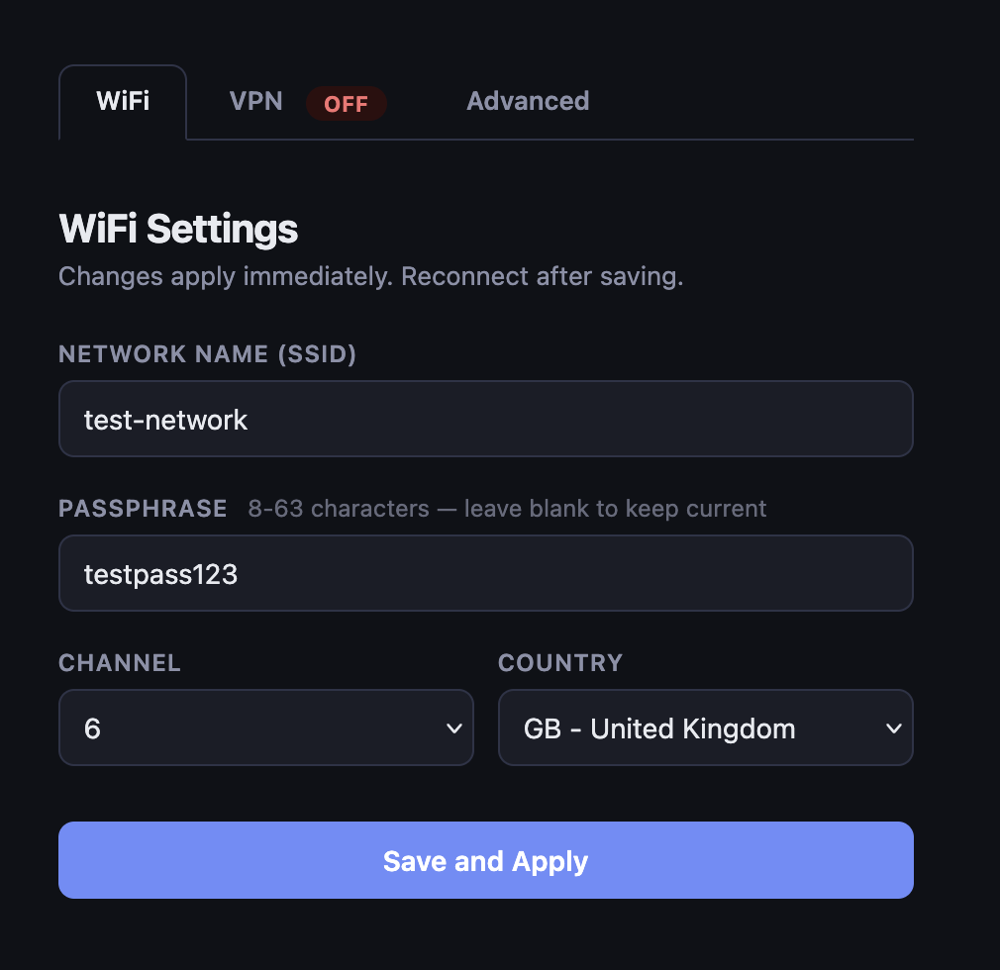
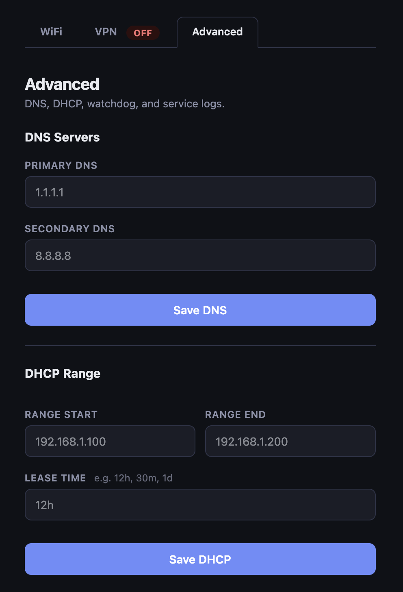
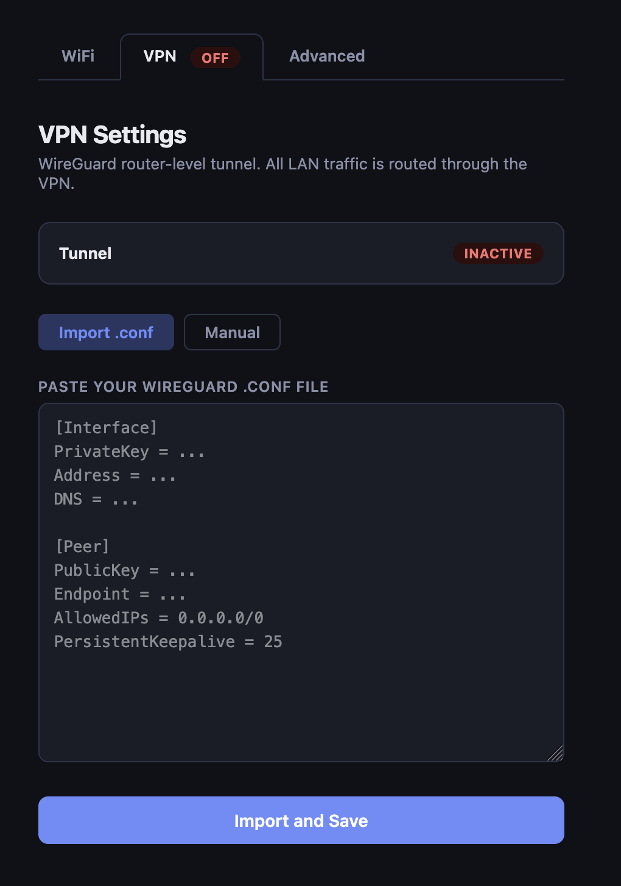

# p5g — Private Cellular Router

Turn a Raspberry Pi and a Huawei USB dongle into a self-contained 4G/5G WiFi router — configured in one command, with a firewall you can read in one file.

- WiFi AP backed by a cellular SIM — no ISP, no consumer router
- NAT, DHCP, and DNS configured automatically
- Firewall drops all inbound connections from the carrier by default
- Web portal to manage WiFi, VPN, DNS, DHCP, and watchdog settings — no SSH needed
- Watchdog restarts the WAN link automatically on failure
- `rollback.sh` undoes everything cleanly if something goes wrong

No cloud accounts. No carrier hardware. No locked equipment. Runs off a USB power bank for portable use.

---

## Contents

- [Quick start](#quick-start)
- [What you get](#what-you-get)
- [Architecture](#architecture)
- [Configuration](#configuration)
- [Config portal](#config-portal)
- [What the installer does](#what-the-installer-does)
- [Who this is for](#who-this-is-for)
- [Known limitations](#known-limitations)
- [Hardware reference](#hardware-reference)
- [Repo structure](#repo-structure)
- [Security model](#security-model)
- [Advanced usage (optional)](#advanced-usage-optional)
  - [Router-level VPN](#router-level-vpn)
  - [WireGuard configuration](#wireguard-configuration)
  - [VPN and SIM usage](#vpn-and-sim-usage)
  - [SIM identity considerations](#sim-identity-considerations)
- [Why this exists](#why-this-exists)
- [Design direction](#design-direction)
- [Related work](#related-work-in-progress)
- [License](#license)

---

## Quick start

**Requirements:**
- Raspberry Pi 4 (2GB+) running Raspberry Pi OS Lite (Bookworm)
- Huawei E3372 USB dongle (unlocked, any SIM)
- SSH access over ethernet

```sh
# Copy repo to the Pi
rsync -avz --exclude .git --exclude .env ./ <user>@<pi-ip>:~/p5g/

# On the Pi
ssh <user>@<pi-ip>
cd ~/p5g
chmod +x scripts/*.sh
sudo ./install.sh
```

`install.sh` detects your dongle, prompts for WiFi credentials (or generates them), and configures everything end-to-end. Setup takes under 10 minutes on a clean Pi.

Full guide: [docs/setup.md](docs/setup.md) — Pi flashing: [docs/flashing.md](docs/flashing.md)

---

## What you get

- A WiFi network backed by a 4G/5G SIM
- Internet routed through the Pi with NAT and DNS
- Firewall that blocks all unsolicited inbound traffic from the carrier
- DHCP for connected devices, served by dnsmasq
- Watchdog that restarts the WAN link on repeated ping failure
- Web portal at `http://10.77.0.1/` for managing settings without SSH

---

## Architecture

```
[ SIM card ]
     |
[ Huawei E3372 USB dongle ]   <-- auto-detected as network mode or PPP mode
     |
[ Raspberry Pi ]
  ├── eth0  (MGMT)    — SSH during setup; never NATed
  ├── wlan0 (LAN AP)  — hostapd, WPA2-PSK; dnsmasq DHCP/DNS; nftables NAT
  └── usb0 / eth1 / ppp0 (WAN)  — dongle interface; firewall drops all inbound
```

**Two modem paths, auto-detected:**
- **Path A (network mode):** dongle appears as `usb0`/`eth1`, DHCP via systemd-networkd
- **Path B (PPP mode):** dongle appears as `/dev/ttyUSB*`, driven by pppd + chat script

`detect_modem.sh` determines the path. You do not need to know in advance.

---

## Configuration

`install.sh` writes `.env` interactively. You can also copy `.env.example` and populate it manually before running.

| Variable | What it controls | Default |
|---|---|---|
| `WIFI_SSID` | Network name | auto-generated |
| `WIFI_PASSPHRASE` | WPA2 passphrase | auto-generated (12 digits) |
| `WIFI_COUNTRY` | Regulatory domain | prompted |
| `WIFI_CHANNEL` | 2.4GHz channel | `6` |
| `WAN_IF` | Dongle interface | auto-detected |
| `LAN_GATEWAY` | Pi's LAN IP | `10.77.0.1` |
| `APN` | Carrier APN (PPP only) | prompted |
| `PORTAL_USER` / `PORTAL_PASS` | Config portal auth | `admin` / `p5g123` — change this |

`.env` is stored at `0600`. It is gitignored and never committed.

---

## Config portal

Installed automatically. Available at `http://10.77.0.1/` from any device on the WiFi.

Protected by HTTP Basic Auth (`PORTAL_USER` / `PORTAL_PASS` from `.env`). LAN-only — not reachable from WAN. Change the default credentials before use.

**WiFi tab** — Change SSID, passphrase, channel, and country. Changes apply immediately; clients need to reconnect.



**VPN tab** — Enable, disable, or reconfigure WireGuard. Import a `.conf` file directly or fill in fields manually. Shows tunnel status and last handshake when active.

**Advanced tab** — DNS upstream servers, DHCP range and lease time, watchdog settings, and a live read-only log viewer per service.



---

## What the installer does

`install.sh` runs nine stages in order, printing pass/fail for each:

1. **Detect modem** — classifies your dongle as network mode or PPP mode automatically
2. **Install packages** — hostapd, dnsmasq, nftables, ppp, usb-modeswitch
3. **Bring up WAN** — configures the dongle interface (or pppd for PPP mode)
4. **Set up WiFi AP** — hostapd on wlan0, WPA2-PSK
5. **Configure DHCP + DNS** — dnsmasq on the LAN
6. **Apply firewall** — nftables ruleset, IPv4 forwarding, NAT
7. **Install services** — systemd units for WAN persistence and watchdog timer
8. **Config portal** — Flask web UI installed and enabled on LAN:80
9. **Health check** — verifies interface, ping, DNS, and HTTPS end-to-end

Individual scripts in `scripts/` can be run standalone for manual recovery.

---

## Who this is for

**Good fit:**
- Developers or researchers who need mobile connectivity they fully control
- Field deployments — remote sites, vehicles, off-grid setups
- Anyone who wants a fully auditable firewall rather than a consumer router
- People who want to understand what their router is actually doing

**Not a good fit:**
- Production infrastructure
- Setups requiring a public-facing IP or open inbound ports
- Non-technical users expecting a consumer router experience

---

## Known limitations

- **2.4GHz only.** 5GHz requires a USB wifi adapter and additional hostapd config.
- **Single WAN.** One dongle. No failover or bonding.
- **Double NAT on Path A.** The HiLink dongle NATs internally. Your Pi gets a `192.168.x.x` address — fine for most use cases.
- **PPP mode gives a public IP** (carrier-assigned, dynamic) — better when a routable address is needed.
- **No IPv6.** IPv6 forwarding is disabled. Carrier IPv6 prefixes are not routed to the LAN.
- **WPA2-PSK only.** WPA3 is not configured.
- **Tested on Raspberry Pi OS Bookworm (Debian 12).** Other Debian-based distros may need adjustments.

---

## Hardware reference

| Part | Notes |
|---|---|
| Raspberry Pi 4 (2GB+) | Pi 3B+ works; Pi 5 works; Pi Zero not suitable |
| Huawei E3372 USB dongle | Get an unlocked unit — see below |
| MicroSD (16GB+, Class 10 / A1) | |
| USB-C 5V/3A power supply | Official Pi PSU recommended |
| USB power bank (5V/3A) | Any USB-C PD bank works for portable use |

**Unlocked E3372 models:**

| Model | Firmware | Notes |
|---|---|---|
| E3372h-320 | HiLink (Path A) | Most widely available, recommended |
| E3372h-607 | HiLink (Path A) | Good availability |
| E3372s-153 | Stick/PPP (Path B) | Less common |
| E3372h-153 | Either | Check listing — some units are carrier-locked |

Avoid carrier-branded units (EE, Vodafone, Three packaging). Look for "unlocked" or "SIM-free".

---

## Repo structure

```
.
├── install.sh              # start here — interactive one-shot setup
├── .env.example            # all config variables with descriptions
├── scripts/
│   ├── detect_modem.sh     # classify dongle — read-only, safe to re-run
│   ├── setup_*.sh          # one script per setup stage
│   ├── gather_state.sh     # read-only network snapshot for debugging
│   └── rollback.sh         # undo everything
├── portal/
│   ├── app.py              # Flask config portal
│   └── templates/          # Jinja2 templates (WiFi, VPN, Advanced)
├── configs/                # config templates rendered at install time
└── docs/                   # setup, troubleshooting, per-mode references
```

---

## Security model

Firewall posture is **deny by default on WAN**:

| Direction | Policy |
|---|---|
| WAN → Pi (inbound) | Drop |
| WAN → LAN (forwarded) | Drop (except established) |
| LAN → WAN | Allow (NAT) |
| LAN → Pi (SSH, DHCP, DNS) | Allow |

No services listen on the WAN interface. SSH is only permitted on the management interface (`eth0`). The nftables ruleset is a single auditable file at `/etc/nftables.conf`.

Opening any inbound port or creating public-facing access is out of scope for this repo.

---

## Advanced usage (optional)

| Task | Command |
|---|---|
| Check modem mode | `sudo ./scripts/detect_modem.sh` |
| Run connectivity check | `sudo ./scripts/healthcheck_modem.sh` |
| Snapshot network state | `sudo ./scripts/gather_state.sh` |
| Undo everything | `sudo ./scripts/rollback.sh` |
| Run stages manually | see [docs/setup.md](docs/setup.md) |

**Per-mode docs:**
- [docs/network-mode.md](docs/network-mode.md) — Path A (HiLink)
- [docs/ppp-mode.md](docs/ppp-mode.md) — Path B (PPP)
- [docs/troubleshooting.md](docs/troubleshooting.md) — common issues

---

### Router-level VPN

Router-level VPN is optional. When enabled, all LAN traffic is routed through a WireGuard tunnel — no per-device configuration needed.

**Kill switch is non-negotiable.** The nftables ruleset allows `LAN → VPN interface` only. There is no `LAN → WAN` forward rule. If the tunnel drops, the policy-drop catches all forwarded traffic — there is no silent fallback to unencrypted routing.

**Trade-offs to understand:**
- All LAN devices share a single tunnel. One IP, one provider trust boundary.
- If the VPN endpoint is unreachable, internet access stops — by design.
- Your carrier can still see that a VPN tunnel is in use and roughly how much data flows.
- Trust shifts from your carrier to your VPN provider.

Run `sudo ./scripts/setup_vpn.sh` to enable. `rollback.sh` tears it down completely.

---

### WireGuard configuration

Any WireGuard provider works. Proton VPN and Mullvad both offer standard `.conf` file downloads from their dashboards.

**Getting your config:**
1. Log into your provider's dashboard
2. Navigate to WireGuard or manual configuration
3. Download a `.conf` file for your chosen server

A standard WireGuard `.conf` looks like this:

```ini
[Interface]
PrivateKey = abc123...
Address = 10.8.0.2/32
DNS = 10.8.0.1

[Peer]
PublicKey = xyz789...
Endpoint = vpn.example.com:51820
AllowedIPs = 0.0.0.0/0
PersistentKeepalive = 25
```

**Via the portal (easiest):** open the VPN tab, switch to Import mode, paste the `.conf` content, and click Import. The portal parses and saves all fields to `.env`. Review, then click Enable.



**Via `.env` manually:**

| `.conf` field | `.env` variable |
|---|---|
| `PrivateKey` | `WG_PRIVATE_KEY` |
| `Address` | `WG_ADDRESS` |
| `DNS` | `WG_DNS` |
| `PublicKey` (under `[Peer]`) | `WG_PEER_PUBLIC_KEY` |
| `Endpoint` | `WG_ENDPOINT` |
| `AllowedIPs` | `WG_ALLOWED_IPS` |
| `PersistentKeepalive` | `WG_PERSISTENT_KEEPALIVE` |

Set `WG_ALLOWED_IPS=0.0.0.0/0` to route all traffic through the tunnel. Then run `sudo ./scripts/setup_vpn.sh`.

`.env` contains your private key. It is stored at `0600` and is gitignored. Do not commit or share it.

---

### VPN and SIM usage

A router-level VPN changes what your carrier sees, not who you are to them.

**What a VPN does:**
- Encrypts traffic between your devices and the VPN endpoint
- Hides content and destinations from your carrier
- Shifts trust from your carrier to your VPN provider

**What remains visible to your carrier regardless:**
- That a SIM is active and connected
- Approximate data volume and session timing
- That a VPN tunnel is in use

**In practice:**
- A personal SIM with a VPN improves privacy over a naked connection, but does not provide anonymity
- Your carrier knows your account. A VPN does not change this.
- Your VPN provider sees your traffic. Choose one accordingly.
- HTTPS encrypts content independently of a VPN.

This project covers the local network boundary only.

---

### SIM identity considerations

The SIM is part of the trust boundary. A carrier knows your account identity, session timing, and approximate data volume regardless of what runs over the connection — VPN or otherwise.

SIM identification requirements vary by jurisdiction. Some regions permit prepaid SIMs with minimal registration; others mandate full identity verification. The regulatory landscape differs significantly by country and changes over time.

This project does not cover SIM sourcing, registration practices, or anonymity strategies. That is a legal and regulatory question specific to your location, and outside the scope of this repo.

---

## Why this exists

Consumer routers are black boxes. Carrier-provided hardware is worse. This project is about running the part of the network you own, on hardware you control, with a firewall you can read in one file.

Setting this up manually is genuinely difficult — NetworkManager, wpa_supplicant, hostapd, systemd-networkd, and pppd all have opinions about who owns which interface, and they conflict. This repo resolves those conflicts so you do not have to.

---

## Design direction

Most networking tooling assumes you trust the infrastructure you are connecting to. This project does not.

The goal is to establish a known-good network layer before any device makes contact with external infrastructure — carrier, cloud, or otherwise. That means controlling the uplink, controlling the firewall, and keeping the setup environment local and auditable.

No cloud dependencies, no remote configuration, no services exposed to the WAN side. The router is a boundary you control. Everything inside it is yours.

---

## Related work (in progress)

A companion project is in development focused on hardened Android device provisioning using GrapheneOS — provisioned over a locally controlled network before the device has ever touched carrier infrastructure or public WiFi.

The two projects are independent. No release date.

---

## License

MIT
